## CONTENT

* **Business Overview**
* **Univariate Analysis**
* **Bivariate Actuarial Explorations & Validation**
* **Multivariate Stratification Matrix**
* **Strategic Conclusions & Action Plan**

::: {.small style="font-size: 0.6em; text-align: center; margin-top: 100px;"}
[🔗 Click Here to View Full Technical Report](Technical_Report.html)
:::

::: {.notes}
This executive summary outlines our multi-dimensional visual and statistical analysis conducted over a motor vehicle insurance portfolio. 

The study uses a real-world dataset containing 354,140 automobile insurance policy transactions from a Spanish insurer between January 2022 and December 2024.

Over the slides, we will go through a disciplined sequence of overview,univariate, bivariate, and multivariate insights, then we will give actionable underwriting recommendations to restore the portfolio's profitability framework and protect our long-term solvency.
:::

---

## Business Overview

::: {layout-ncol=2 style="margin-bottom: -10px;"}
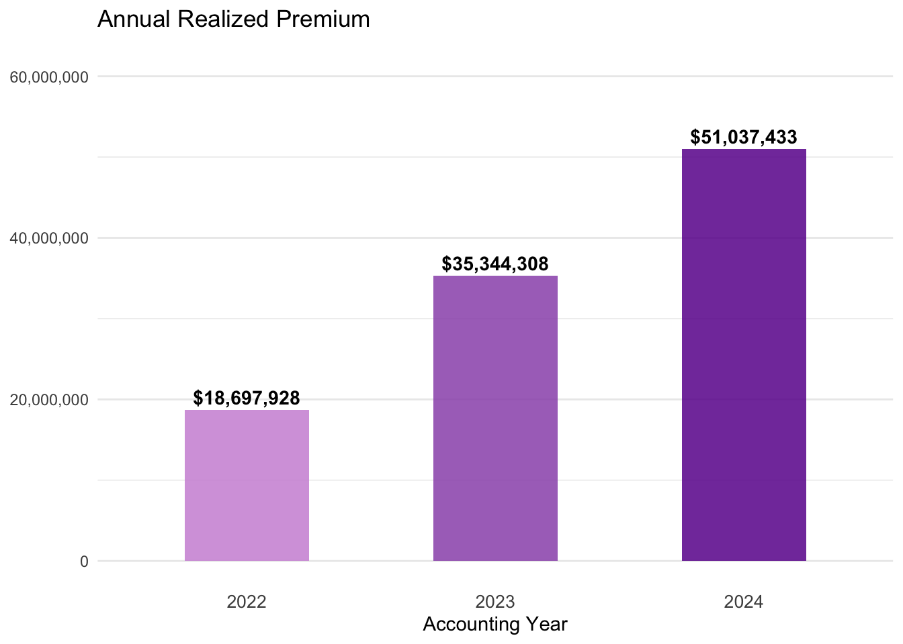{fig-align="center" style="width: 100%; max-height: 350px; object-fit: contain; border-radius: 4px;"}

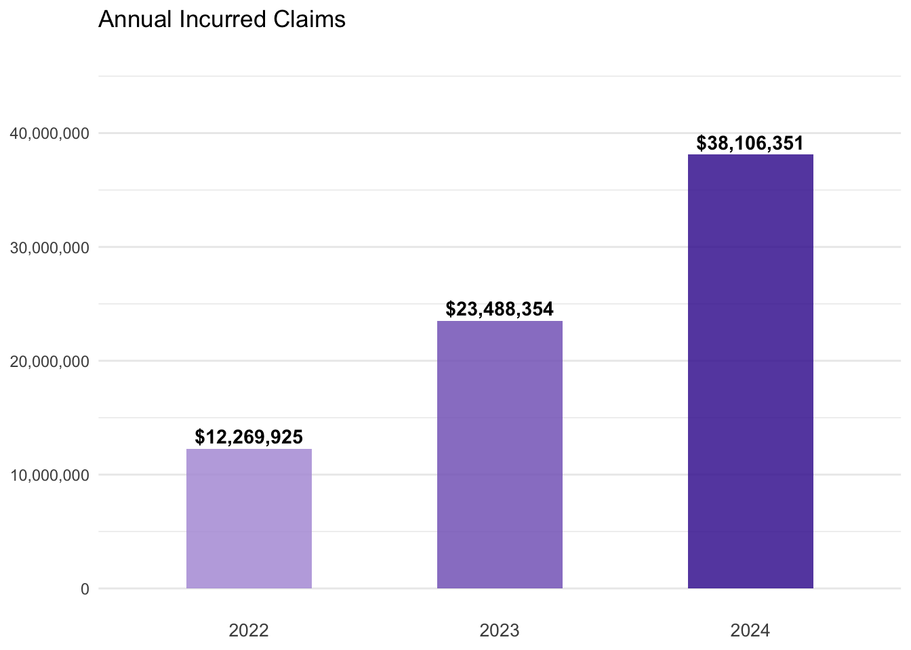{fig-align="center" style="width: 100%; max-height: 350px; object-fit: contain; border-radius: 4px;"}
:::

::: {.small style="font-size: 0.50em; line-height: 1.2;"}

* **Explosive Revenue Growth**: Realized total premium volume expanded **173%** year-over-year, peaking strongly at \$51.0M in 2024.
* **Aggressive Loss Escalation**: Annual incurred claims grew even faster, climbing **210%** to peak at \$38.1M in 2024.
* **Actuarial Margin Warning**: Top-line revenue expansion is heavily masking an underlying operational imbalance where aggregate liabilities are outstripping pricing inflation across the timeline.

:::

::: {.notes}
Between 2022 and 2024, our sales channels achieved explosive top-line growth, with realized annual premium revenue nearly tripling to 51 million dollars. However, a parallel actuarial evaluation reveals that our annual incurred claims grew even faster, climbing to over 38.1 million dollars—a staggering 210 percent increase. This tells us that our aggressive premium expansion has inadvertently imported high-velocity claim liabilities. The top-line growth is masking severe systemic margin erosion.
:::

---

## Univariate Analysis: Product Types & Acquisition Channel

::: {layout-ncol=2 style="margin-bottom: -10px;"}
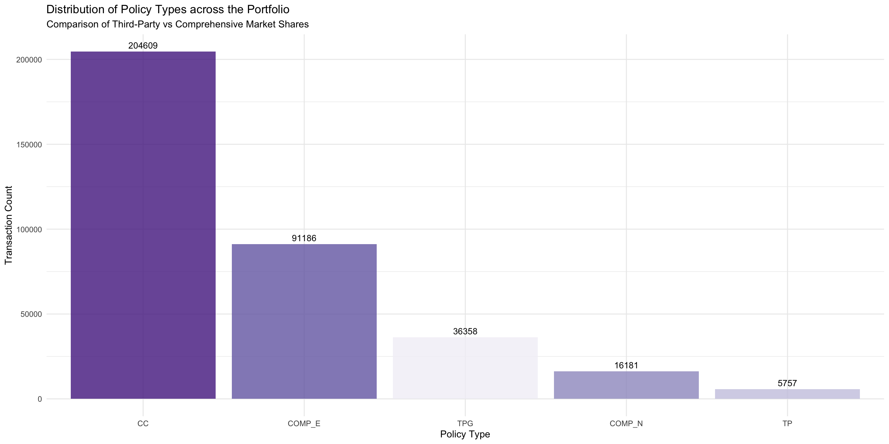{fig-align="center" style="width: 100%; max-height: 350px; object-fit: contain; border-radius: 4px;"}

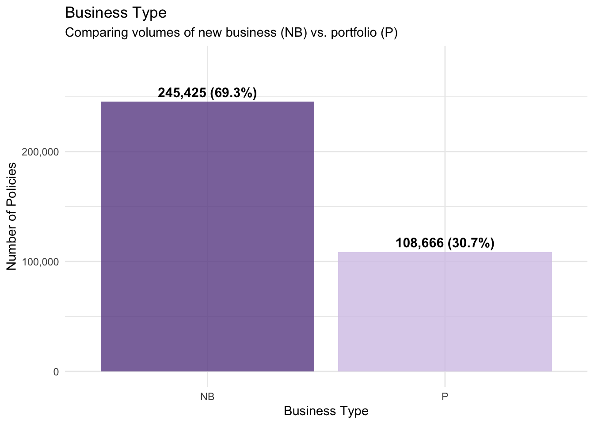{fig-align="center" style="width: 100%; max-height: 350px; object-fit: contain; border-radius: 4px;"}
:::

::: {.small style="font-size: 0.50em; line-height: 1.3; margin-top: 5px; padding: 0 15px;"}

* **Core Portfolio Driver**: Standard Comprehensive tier (**CC**) dominates the core portfolio footprint with **57.8%** market share (204,609 transactions).
* **High Dependence on New Customers**: An overwhelming **69.3%** of active risk exposure stems from unvetted **New Business (NB)** acquisitions.
* **Higher Risk Uncertainty**: Extreme reliance on newly acquired customer streams increases predictive uncertainty compared to stable renewal blocks (P).

:::

::: {.notes}
To understand our core business composition, slide three breaks down the market distributions of our portfolio.
First, looking at policy types, CC dominates the portfolio with over 204,000 transactions, followed by COMP_E at approximately 91,000. The remaining categories, TPG, COMP_N, and TP, represent much smaller shares.
Second, regarding business types, New Business (NB) is our primary driver, accounting for 69.3% of the total volume with over 245,000 policies. Portfolio business (P) makes up the remaining 30.7%, with nearly 109,000 policies.
In short, our current volume is highly driven by new business and CC policy types. 
:::

---

## Univariate Analysis: Severity & Quality

::: {layout-ncol=2 style="margin-bottom: -10px;"}
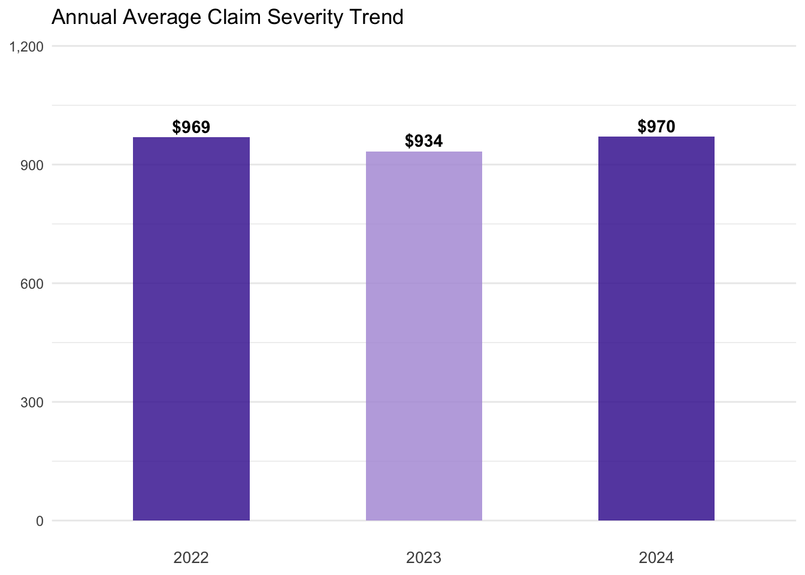{fig-align="center" style="width: 100%; max-height: 350px; object-fit: contain; border-radius: 4px;"}

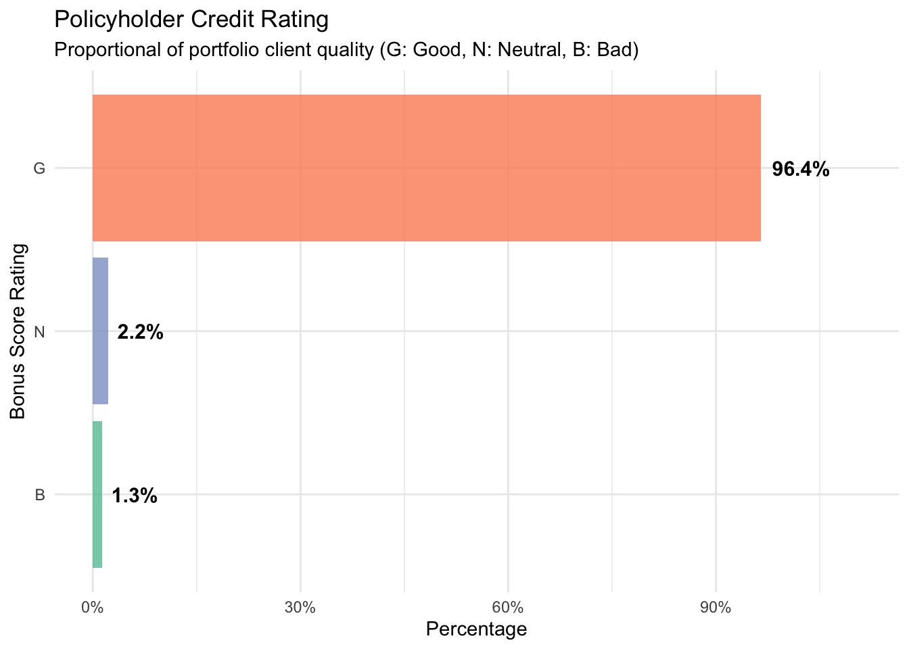{fig-align="center" style="width: 100%; max-height: 350px; object-fit: contain; border-radius: 4px;"}
:::

::: {.small style="font-size: 0.50em; line-height: 1.3; margin-top: 5px; padding: 0 15px;"}

* **Stable Claim Severity**: Individual accident repair costs remained remarkably uniform, fluctuating less than 4% around the **\$950 mark**.
* **High Concentration of Good Credit**: Policyholder baseline credit quality is heavily concentrated in the **Good (G) rating at 96.4%**.
* **Main Cause of Rising Claims Costs**: The sharp increase in total claims costs (from \$12.3M to \$38.1M) is driven **entirely by the sheer volume of claims** rather than individual inflation or deteriorated client credit scores.

:::

::: {.notes}
This slide isolates two key operational metrics: average claim severity and policyholder credit tracking. 
Remarkably, the average cost of an individual claim has remained completely stable, fluctuating around the 950 dollar mark over the three years. Simultaneously, our policyholder credit ratings are highly optimized, with 96.4 percent localized in the "Good" category. 
Connecting these insights leads to a vital strategic conclusion: our skyrocketing total claim costs are not driven by severity inflation or poor customer credit, but entirely by the sheer frequency of claims.
:::

---

## Univariate Analysis: Active Period & Vehicle Value

::: {layout-ncol=2 style="margin-bottom: -10px;"}
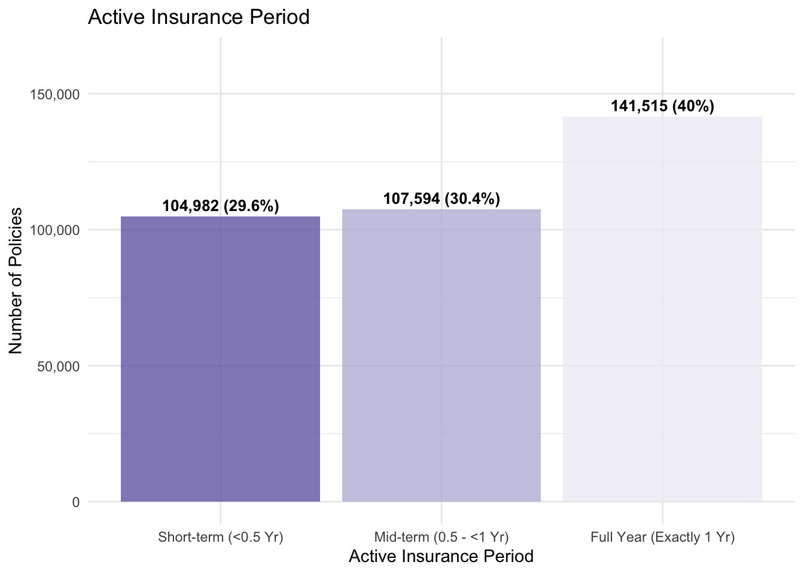{fig-align="center" style="width: 100%; max-height: 350px; object-fit: contain; border-radius: 4px;"}

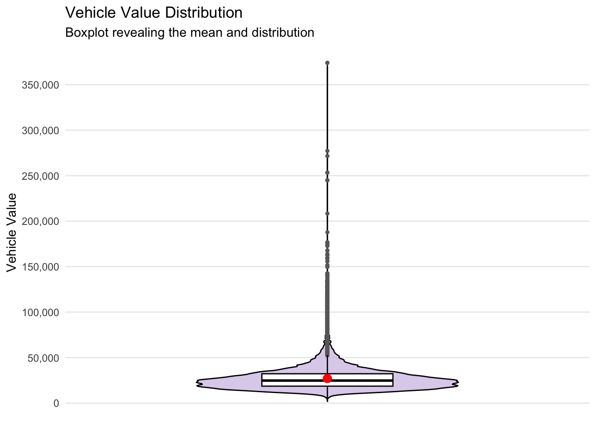{fig-align="center" style="width: 100%; max-height: 350px; object-fit: contain; border-radius: 4px;"}
:::

::: {.small style="font-size: 0.50em; line-height: 1.3; margin-top: 5px; padding: 0 15px;"}

* **High Contract Volatility**: Only about 40% of policies run full term, while the remaining 60% are mid-term cancellations or lapses, making exposure quite unstable.
* **Right-Skewed Vehicle Values**: Most vehicles are valued below $50,000, but there is a long right tail of high-end cars reaching up to $380,000.
* **Key Implication for Pricing**: Underwriting and pricing models need to properly adjust for partial policy exposure, so that total-loss and volatility risks are not underestimated.

:::

::: {.notes}
This slide evaluates active contract periods and physical vehicle value distributions. 
First, standard full-year contracts represent only 40 percent. The remaining 60 percent consists of short-term or early-canceled policies, meaning exposure-weighting is mandatory for any accurate pricing model. 
Second, our insured vehicle values exhibit a heavily right-skewed distribution. While our standard exposure is concentrated under 50,000 dollars, a thin tail of high-performance outliers reaches up to 380,000 dollars, presenting severe total-loss shock risks that could impact corporate solvency.
:::

---

## Univariate Analysis: Vehicle Power-to-Weight & Vehicle Age

::: {layout-ncol=2 style="margin-bottom: -10px;"}
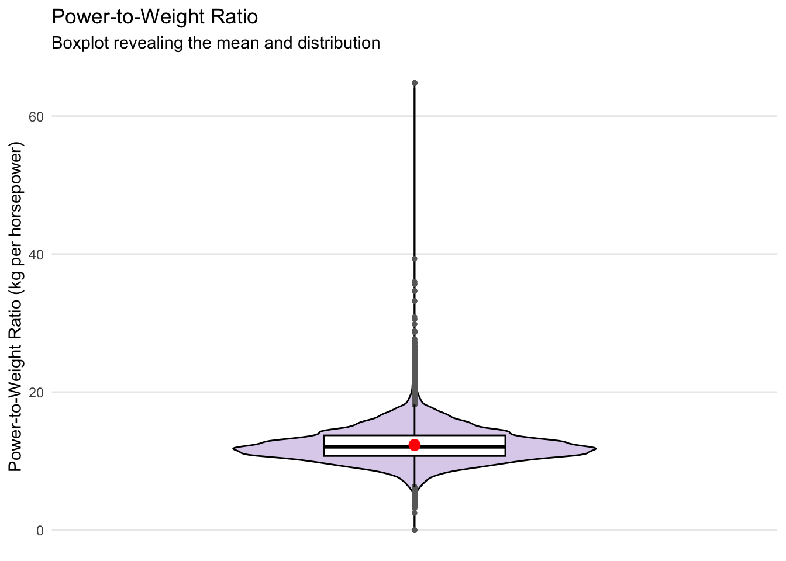{fig-align="center" style="width: 100%; max-height: 350px; object-fit: contain; border-radius: 4px;"}

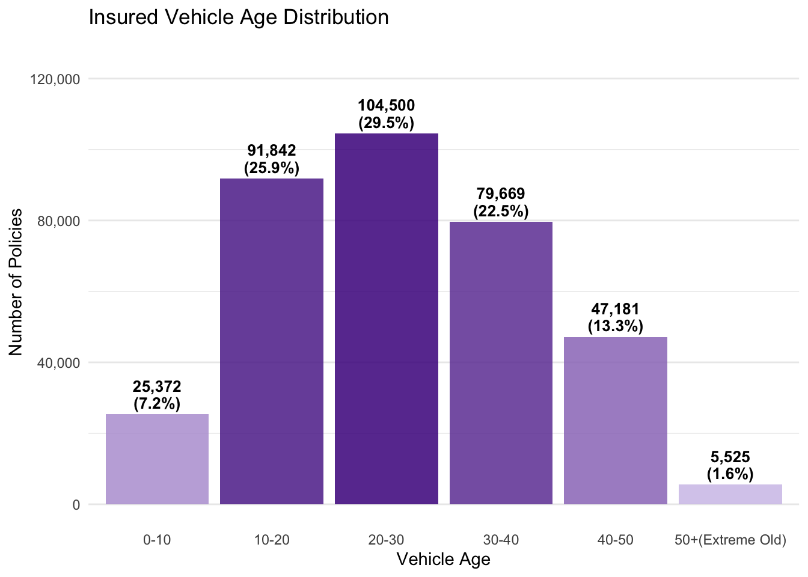{fig-align="center" style="width: 100%; max-height: 350px; object-fit: contain; border-radius: 4px;"}
:::

::: {.small style="font-size: 0.50em; line-height: 1.3; margin-top: 5px; padding: 0 15px;"}

* **Consistent Vehicle Performance**: Most vehicles in the portfolio show very similar power-to-weight characteristics, mainly within the typical passenger range of 10–15 kg/hp.
* **Significant Aging Exposure**: The portfolio is heavily skewed toward older vehicles, with nearly 70% over 20 years old and more than 30% exceeding 30 years.
* **Key Risk Insight**: While older vehicles tend to have lower total-loss values, they carry higher mechanical risk due to wear and tear, as well as limited parts availability.

:::

::: {.notes}
This slide focuses on the physical and structural characteristics of the vehicle portfolio, particularly performance and age. 
The power-to-weight ratio is very consistent across the portfolio, indicating that we have very few high-performance or sports vehicles.
The more important insight is the aging profile: over 73% of vehicles are older than 20 years, and about 31.7% are over 30 years old. While these vehicles usually have lower market values, they are more prone to mechanical failure, and repair costs can be higher due to parts scarcity—both of which gradually pressure and erode loss margins over time.
:::
---

## Univariate Analysis: Seats Capacities & Driver Age

::: {layout-ncol=2 style="margin-bottom: -10px;"}
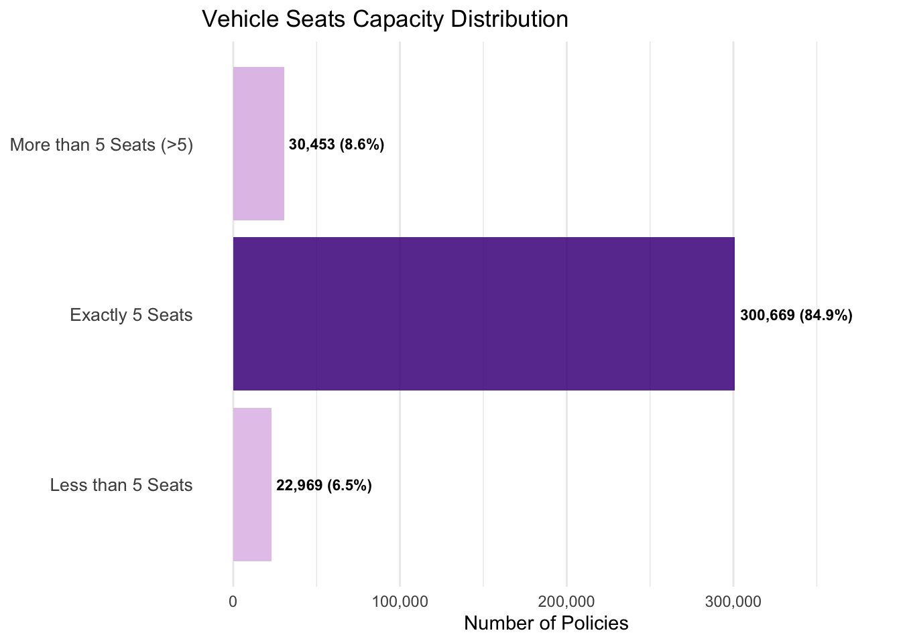{fig-align="center" style="width: 100%; max-height: 350px; object-fit: contain; border-radius: 4px;"}

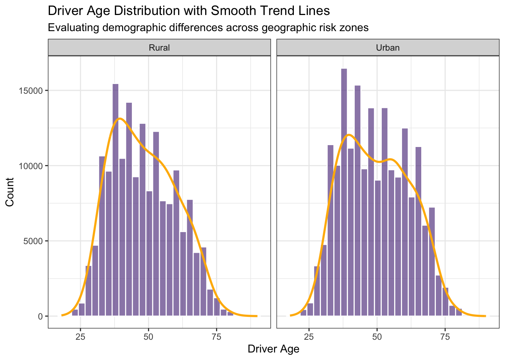{fig-align="center" style="width: 100%; max-height: 350px; object-fit: contain; border-radius: 4px;"}
:::

::: {.small style="font-size: 0.50em; line-height: 1.3; margin-top: 5px; padding: 0 15px;"}

* **Strong Product Concentration**: The portfolio is heavily dominated by standard 5-seater sedans, making up about 84.9% of all policies.
* **No Meaningful Urban–Rural Difference in Driver Profile**: Although the portfolio is split between urban (53.8%) and rural (46.2%) areas, both segments show very similar driver age patterns, mainly concentrated in the 35–55 age group.
* **Key Insight**: Location mainly affects portfolio size, but it does not significantly change the underlying driver demographics or risk profile.

:::

::: {.notes}
This slide looks at seating capacity and how driver age patterns vary across regions. 
Our portfolio is highly concentrated at standard 5-seater passenger cars.It represents a typical private passenger car market, with very low exposure to specialized smaller cars or larger multi-purpose/commercial passenger vehicles.
And both rural and urban areas show a very similar age profile, the vast majority of drivers are concentrated between 35 and 55 years old.

:::
---

## Bivariate Analysis: Driver Age & Claim Frequency

::: {layout-ncol=2 style="margin-bottom: -10px;"}
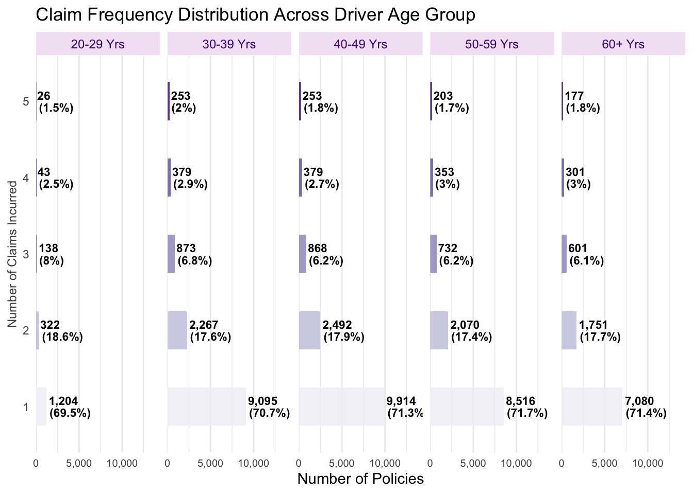{fig-align="center" style="width: 100%; max-height: 350px; object-fit: contain; border-radius: 4px;"}

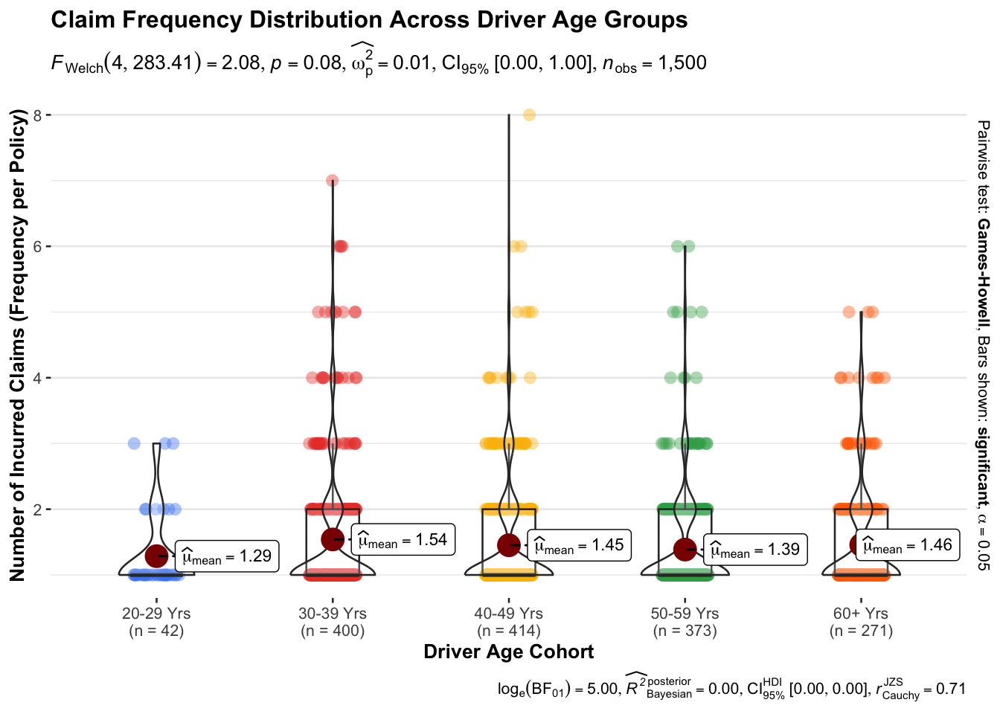{fig-align="center" style="width: 100%; max-height: 350px; object-fit: contain; border-radius: 4px;"}
:::

::: {.small style="font-size: 0.50em; line-height: 1.3; margin-top: 5px; padding: 0 15px;"}

* **Consistent Claim Behavior Across Age Groups**: Across all driver age bands, claim patterns are very similar, with roughly 71% of drivers having 1 claim and about 17% having 2 claims.
* **No Significant Age Effect on Claims**: A Welch’s ANOVA test shows that driver age does not have a statistically significant impact on claim frequency (F = 2.08, p = 0.08).
* **Key Conclusion**: We cannot reject the null hypothesis, meaning driver age is not a strong factor for segmenting or controlling claim frequency in this portfolio.

:::

::: {.notes}
This slide executes our formal bivariate statistical validation. 
What we see is a very consistent pattern across the portfolio,around 71% of policies with claims have exactly one claim, and this holds steady across all driver age groups.

To test this more rigorously, we ran a Welch’s One-Way ANOVA. The result gives a p-value of 0.08, which is above the 0.05 significance level. In practical terms, this means we do not find strong statistical evidence that driver age has a meaningful impact on claim frequency.
:::

---

## Bivariate Analysis: Vehicle Severity Impact & Product Performance

::: {layout-ncol=2 style="margin-bottom: -10px;"}
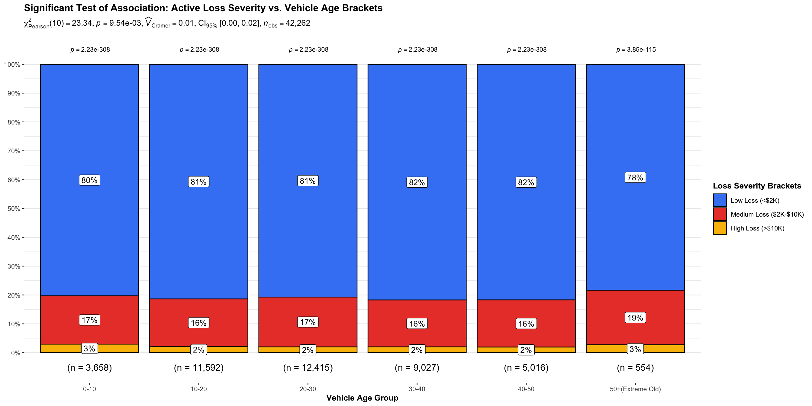{fig-align="center" style="width: 100%; max-height: 350px; object-fit: contain; border-radius: 4px;"}

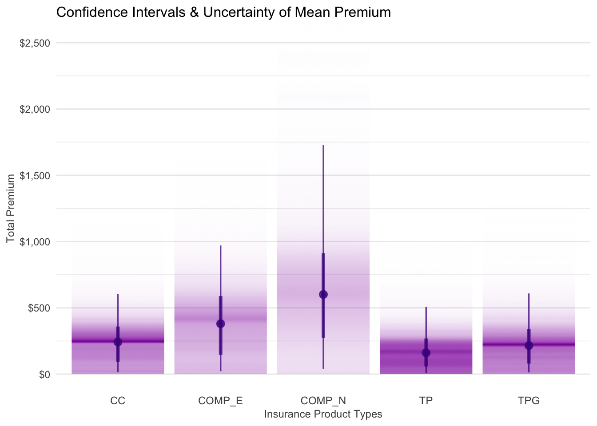{fig-align="center" style="width: 100%; max-height: 350px; object-fit: contain; border-radius: 4px;"}
:::

::: {.small style="font-size: 0.50em; line-height: 1.3; margin-top: 5px; padding: 0 15px;"}

* **Minimal Link Between Vehicle Age and Severity**: Chi-Square results show that vehicle age has almost no meaningful relationship with individual accident costs, with a very low Cramer’s V of 0.01. Most claims remain concentrated in the low-loss range (below $2K).
* **High Pricing Volatility in COMP_N**: While COMP_N has the highest average premium (around $600), it also shows wide and unstable pricing variation, with premiums stretching up to about $1,700. This indicates significant uncertainty in how risk is being priced.
* **Stable Pricing in Other Products**: In contrast, `CC`, `TPG`, and `TP` maintain highly predictable, tight, and tightly clustered pricing intervals.

:::

::: {.notes}
This slide merges asset association with premium distributions. 
Pearson's Chi-Square test confirms that vehicle age does not structurally dictate individual accident severity scales, yielding a negligible Cramer's V of only 1 percent. 
Meanwhile, our premium gradient mapping unmasks a vital underwriting threat: COMP_N charges the highest point-estimate premium but suffers from massive, erratic interval volatility, signaling data sparsity or extreme pricing risk.
:::
---

## Bivariate Analysis: Product Profitability

::: {layout-ncol=2 style="margin-bottom: -10px;"}
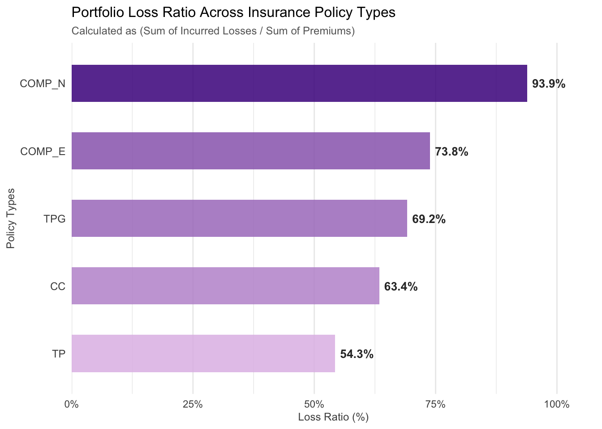{fig-align="center" style="width: 100%; max-height: 350px; object-fit: contain; border-radius: 4px;"}

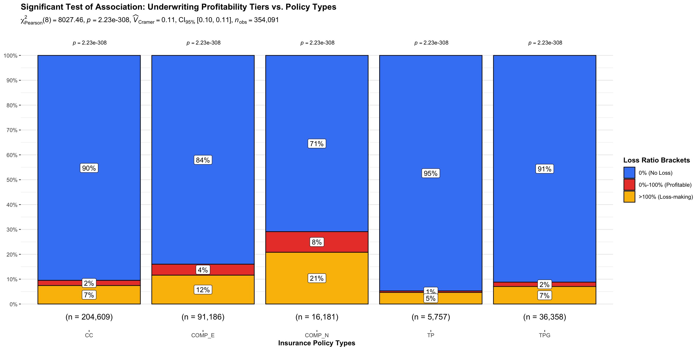{fig-align="center" style="width: 100%; max-height: 350px; object-fit: contain; border-radius: 4px;"}
:::

::: {.small style="font-size: 0.50em; line-height: 1.3; margin-top: 5px; padding: 0 15px;"}

* **Profitability Gap in COMP_N**: Despite generating significant premium volume, COMP_N is severely unprofitable, with an overall loss ratio of 93.9%, showing a clear disconnect between revenue and actual underwriting performance.
* **Strong Statistical Difference Across Products**: A Kruskal–Wallis test confirms that profitability differs significantly across product types (p < 2.2 × 10⁻¹⁶), meaning the financial performance is not random but structurally driven by product design.
* **Main Source of Losses**: COMP_N also has the lowest proportion of claim-free policies, with 21.2% of contracts experiencing loss ratios above 100%, making it the key contributor to portfolio deficits.

:::

::: {.notes}
This slide focuses on product-level profitability differences. 
The results clearly show that COMP_N is the worst-performing segment, with a very high 93.9% loss ratio, indicating substantial capital leakage. 
In contrast, Third-Party Only performs much better, with a more efficient 54.3% loss ratio.
A Kruskal–Wallis test confirms that these differences are statistically significant, meaning profitability varies meaningfully across product lines rather than by chance. Notably, COMP_N stands out as structurally weak, with more than 21% of policies generating losses above 100%, making it a key driver of overall underwriting deterioration.
:::
---

## Bivariate Analysis: Key Underwriting Drivers & Multi-Year Trends

::: {layout-ncol=2 style="margin-bottom: -10px;"}
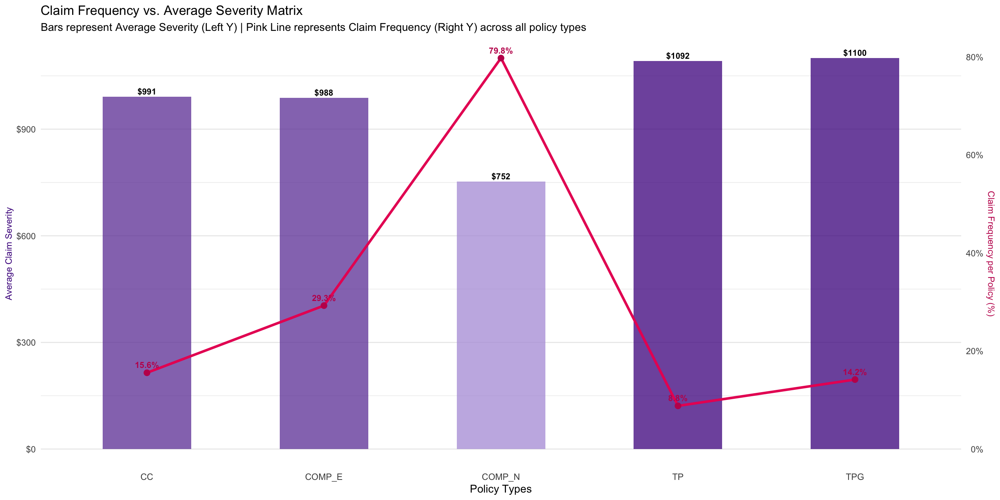{fig-align="center" style="width: 100%; max-height: 350px; object-fit: contain; border-radius: 4px;"}

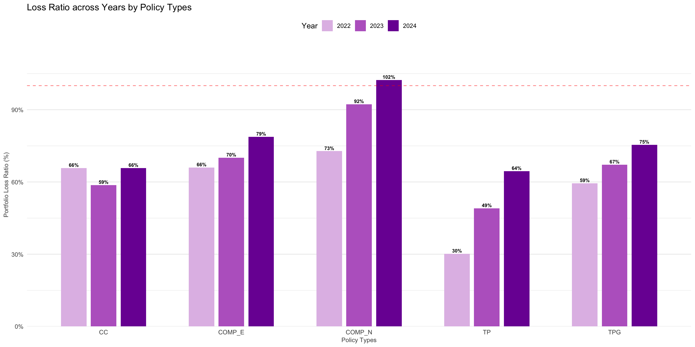{fig-align="center" style="width: 100%; max-height: 350px; object-fit: contain; border-radius: 4px;"}
:::

::: {.small style="font-size: 0.50em; line-height: 1.3; margin-top: 5px; padding: 0 15px;"}

* **COMP_N Driven by Frequency, Not Severity**: The breakdown shows that COMP_N is mainly a frequency problem—claim severity is relatively low at around $752, but claim frequency is extremely high at 79.8%.
* **Clear Underwriting Deterioration**: COMP_N has now crossed the break-even threshold, worsening year-on-year and reaching a 102% loss ratio in 2024, indicating structural unprofitability.
* **Portfolio-Wide Margin Pressure**: The decline is not isolated—most product lines show a steady increase in loss ratios over time, with the exception of CC, pointing to broad-based margin erosion across the portfolio.

:::

::: {.notes}
This slide combines the risk decomposition with the time trend analysis. The key takeaway is that COMP_N is not suffering from high claim costs per incident, but from extremely high claim frequency at 79.8%, which is the main driver of losses.

Over time, this issue has also been getting worse. The loss ratio for COMP_N has continued to rise and has now exceeded the break-even point, reaching a 102% loss ratio in 2024, confirming a clear deterioration in underwriting performance.
:::

---

## Multi-Dimensional Portfolio Boxplot Matrix

::: {layout-ncol=1 style="margin-bottom: -10px; text-align: center;"}
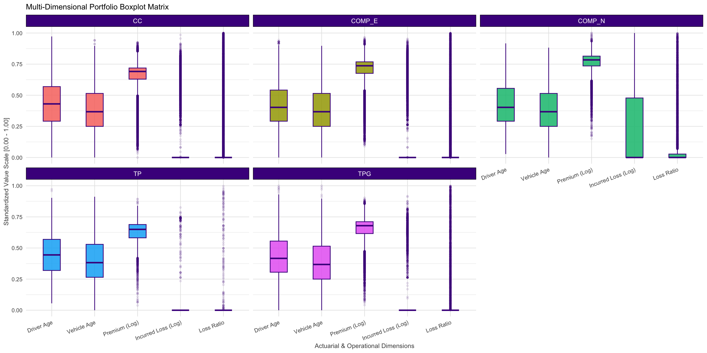{fig-align="center" style="width: 75%; max-height: 350px; object-fit: contain; border-radius: 4px;"}
:::

::: {.small style="font-size: 0.50em; line-height: 1.3; margin-top: 5px; padding: 0 15px;"}

* **Demographic Consistency Across the Portfolio**: Driver age and vehicle age distributions are highly overlapping across product lines, suggesting there is very little natural customer segmentation or meaningful demographic differentiation between segments.
* **COMP_N as a Clear Outlier**: When the data is rescaled, COMP_N stands out as a high-volatility segment, with both elevated premium levels and a noticeably higher incurred loss profile compared to other products.
* **Stability Driven by Claim-Free Policies**: Most other product lines show heavy clustering near zero claims, indicating that overall portfolio stability is largely supported by a large base of claim-free contracts.

:::

::: {.notes}
This slide shows the standardized boxplot matrix, where all key variables are rescaled onto a 0–1 scale to allow direct comparison across dimensions.

The first clear insight is that demographic variables are largely consistent across all product lines, meaning driver age does not meaningfully differentiate risk within the portfolio.

In contrast, COMP_N behaves very differently from the rest. It shows wider and more volatile premium distributions, along with a higher baseline of incurred losses. This clearly sets it apart from the standard third-party products and points to a structurally weaker and more unstable risk profile.
:::

---

## Strategic Conclusions

::: {.small style="font-size: 0.65em; line-height: 1.3; padding: 0 15px;"}

* **COMP_N has serious pricing issues**: COMP_N recorded a 102% loss ratio in 2024. The main problem is extremely high claim frequency (79.8%) with relatively small claim amounts. This suggests many policyholders are making frequent minor claims, leading to continuous underwriting losses.
* **Older vehicles in New Business are riskier**: For vehicles older than 10 years, New Business policies show much higher loss ratios compared to renewal business. This suggests potential adverse selection, where higher-risk customers are more likely to enter the portfolio through older vehicles.
* **Most exposure comes from older vehicles**: A large share of the portfolio consists of 5-seater vehicles aged between 10 and 40 years. As a result, these older-vehicle segments have a disproportionate impact on overall profitability.

:::

::: {.notes}

This slide summarizes the key findings from our analysis. First, COMP_N is the most unprofitable product, with a 102% loss ratio driven by very high claim frequency. Second, older vehicles in New Business perform worse, suggesting adverse selection from higher-risk customers. Finally, the portfolio is concentrated in older 5-seater vehicles, which strongly impacts overall profitability and underwriting stability.

:::

---

## Action Plan

::: {.small style="font-size: 0.65em; line-height: 1.3; padding: 0 15px;"}
 
* **Increase deductibles for COMP_N**: This helps reduce frequent small claims and improves overall loss experience.
* **Apply stricter underwriting for older vehicles in New Business**: For vehicles older than 10 years, additional claims-history checks should be introduced, while also prioritising the retention of existing renewal customers.
* **Adjust pricing for older vehicles**: Premiums for vehicles above 15 years old should be increased to better reflect their higher underlying risk.

:::

::: {.small style="font-size: 0.6em; text-align: center; margin-top: 100px;"}
[🔗 Click Here to View Full Technical Report](Technical_Report.html)
:::

::: {.notes}

This slide presents the recommended underwriting action plan. First, higher deductibles for COMP_N can reduce frequent small claims and improve profitability. Second, stricter underwriting and claims-history checks should be applied to older vehicles in New Business to reduce adverse selection risk. Finally, premiums for vehicles older than 15 years should be increased to better reflect their higher underlying risk.

:::

